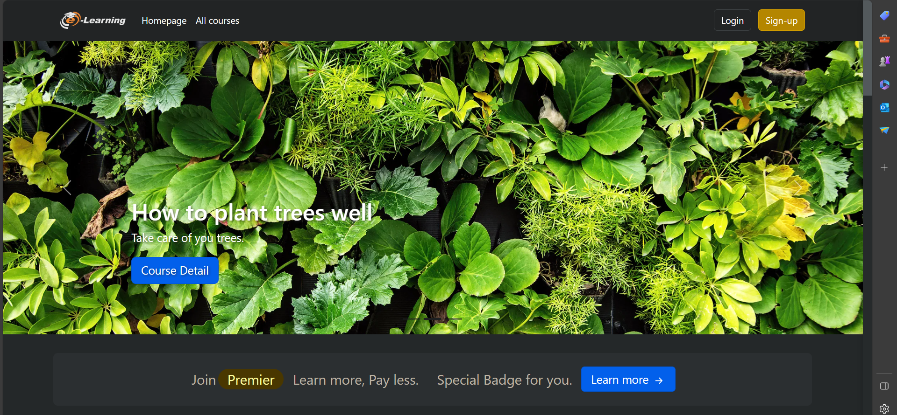

# 👋 Valiant Dmello

**`Passionate Software Developer | Python | JavaScript | Django | React | Node | AWS | SQL | MongoDB`**

Welcome to my GitHub world! I'm on a journey to craft digital experiences and solve real-world problems through code. My projects are not just lines of code; they are stories of innovation and creativity.

  

  

  
  

---

### 🛠️ Technologies & Tools

 

---
<!---
### 📈 GitHub Stats

&nbsp;

--->

---

### 🎥 Latest Projects

  

    
    
A Django-based Learning Management System (LMS) facilitating online education with features like user registration, course creation, enrollment, premium plans, and an admin panel for effective course management.

  

  

    
    
Eventech: A comprehensive event management web interface with user-friendly frontend for organizers to manage events and attendees, and an attendee portal for event registration and details viewing.

  

  

    
    

      Parkinson's Disease Prediction project employing machine learning on diverse datasets (gait, speech, handwriting), achieving high accuracy with models, and providing a user-friendly Flask app for early        detection.    
    

  

  

    
    

      Movie Recommendation System using PySpark, implementing collaborative filtering with the ALS algorithm and content-based filtering using TF-IDF and cosine similarity, based on the Movielens 100k       dataset from Kaggle.    
    

  

  <!-- Add more project divs as needed -->

---

### 🌐 Connect with Me

I'm always open to collaboration and new opportunities. If you're looking for a dedicated and skilled software developer, let's connect and create something amazing together.

- Email: valiantdmello@gmail.com
- LinkedIn: [LinkedIn](www.linkedin.com/in/dmellov)
